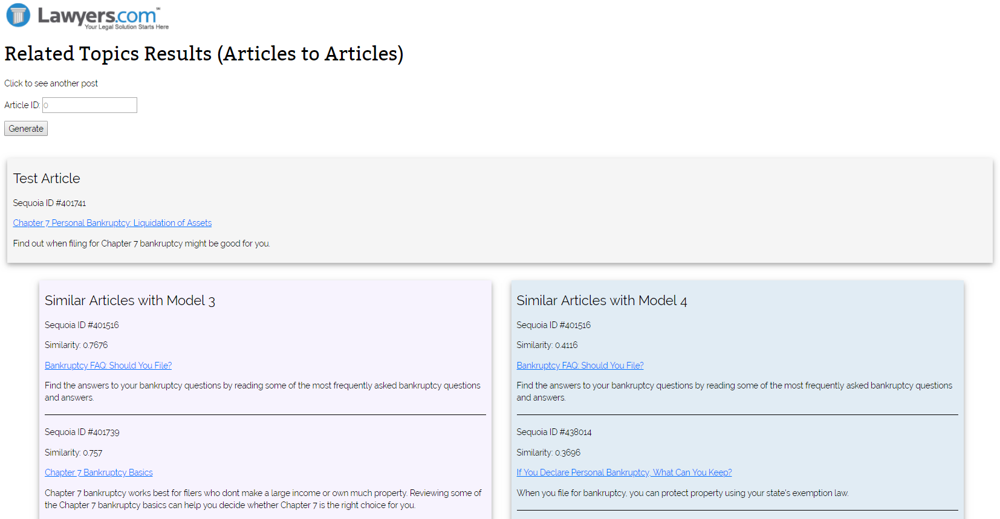
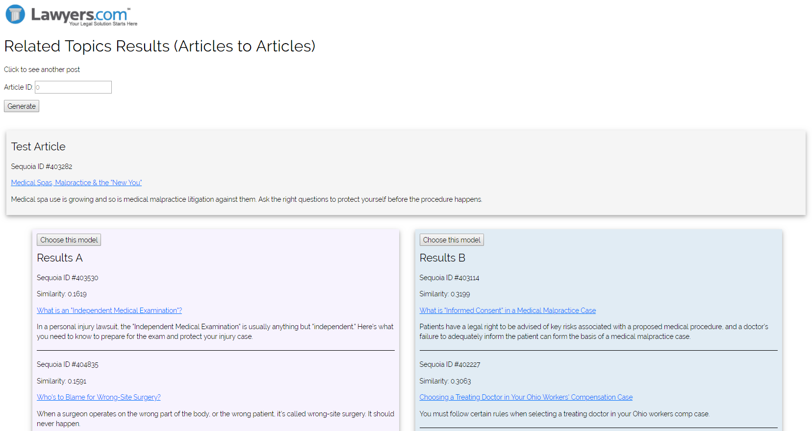
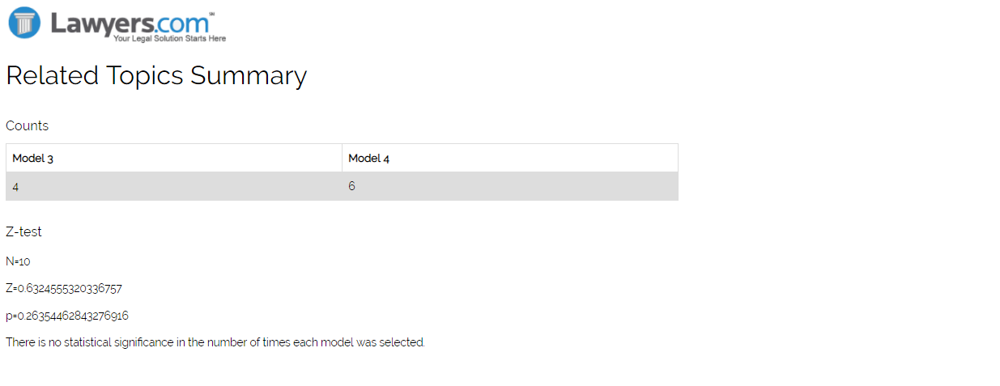

# ML_Demo_Tool

This repo contains two basic setups to host a Flask server that can be used to demo
a model for the business team. One is a general page to show the result, and the other
is designed to perform on-the-fly AB testing, which is useful in objectively choosing
between two models. To make this easier to copy+paste, I have used an
existing setup to easily show how it works and where to replace values.

Sample Page (running flask_script.py & generate_page.html)

  

Sample AB-testing page (running flask_script_ab_testing.py & generate_page_abtesting.html)

  

AB-testing summary page (ab_test_summary.html)

  

## Libraries used

* Flask
* Pandas
* Numpy
* sklearn
* scipy
* dill

Note: Only Flask is required to run the Flask server, but the others were used in the example.

## Getting Started

After cloning, unzip the zip file in ref_tables to run the example. Run "python flask_script.py" 
or "python flask_script_ab_testing.py" to start the Flask server. The page can be opened by typing 
"XXX.XXX.XX.XX:YYYY" (where XXX.XXX.XX.XX is the ip address of the computer this is being run on, 
and YYYY is the port number the Flask server is hosting on. The port number is set as 8996 
for flask_script_ab_testing.py and 8997 for flask_script.py). For the ab-testing page, the summary
can be accessed via "XXX.XXX.XX.XX:YYYY/summary"

### Prerequisites

- Python 2.7 (may need to change small things to work with Python 3)
- Windows 7 64bit
- Linux/Ubuntu 15.03

### File or folder structure information

*flask_script.py* contains a basic Flask script that imports data, calculates values, and outputs to an HTML page. This 
script generates results from two separate models and output them side by side to showcase the results.

*flask_script_ab_testing.py* contains the basic Flask script that runs similar to flask_script.py, but with 
extra buttons to 'choose' between two models. The results shown on this page are randomized, so the 
left column ("Results A") can be the results of either of the two models, and similarly with the right column (Results B).

*ref_tables/* is a directory that is used to store files that will be imported. It is only made as a convenience. Other 
directories can be defined in the script.

*static/* contains images that the html page can load (e.g. Lawyers.com logo or css files)

*templates/* contains the HTML page that the model results can be shown on

 

By default, Flask looks for "static/" and "templates/" folder in the same directory as the location of the Flask script, so
if, by any reason, a different setup is preferred, please look into Flask configurations to do so. Otherwise, just leave
the set up as is and it should work fine.

## ToDos*

* Make it look nicer I guess
* Add t test for N<30 and z test otherwise

## Author

* **Brian Song** - I got bored
